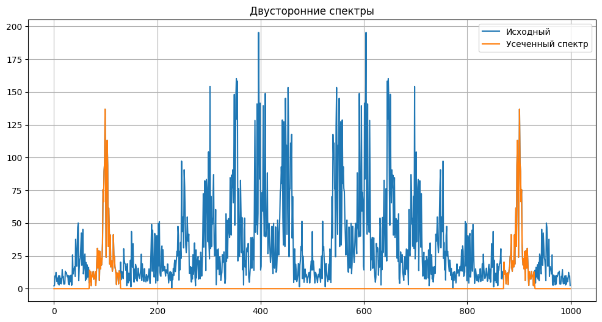
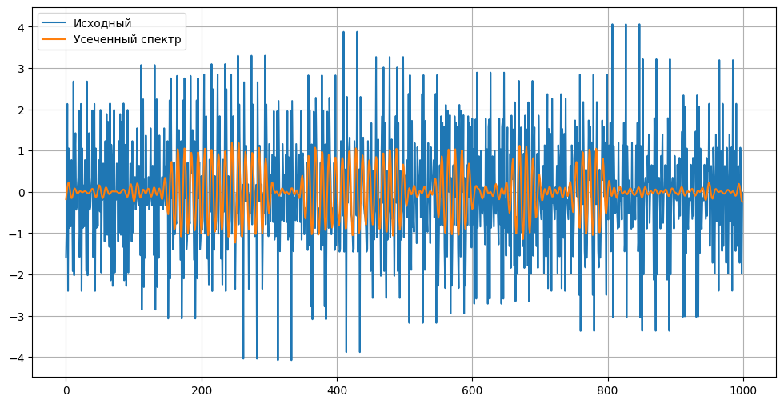
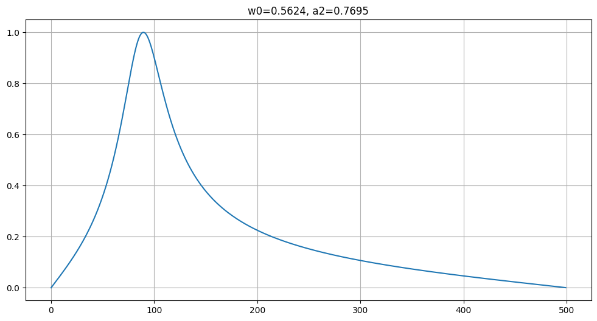
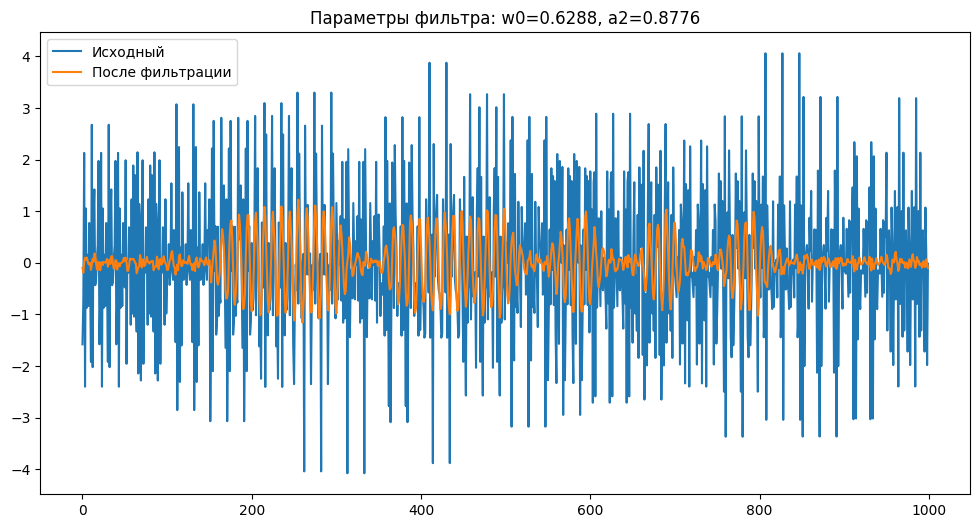

# Поиск оптимальных коэффициентов полосового фильтра

## Постановка задачи
Задан полосовой фильтр 2-го порядка с передаточной функцией

$$\begin{equation}
    {H(z) = \frac{\frac{1-a_2}{2} - \frac{1-a_2}{2} z^{-2}}{1 - (a_2+1)\cos(\omega_0)z^{-1} + a_2 z^{-2}}}.
\end{equation}$$

Необходимо определить значения коэффициентов $\omega_0, a_2$, при которых наилучшим образом выполняется фильтрация зашумленного кода Морзе.

## Предлагаемое решение

Расчеты приведены в блокноте [notebook.ipynb](notebook.ipynb)

### "Вручную" усечен спектр исходного зашумленного сигнала
Обнулены коэффициенты разложения за пределами окрестности

$$ \begin{equation}
    f = f_{0} \pm \Delta f/2,
\end{equation} $$

где частоте ${f_0}$ соответствует $n=99$, а ${\Delta f} \rightarrow {\Delta n = 60}$

Сигнал, соответствующий усеченному спектру:

Усеченный спектр принят в качестве эталона.

### Определена функция потерь как сумма квадратов отклонений спектра фильтрованного сигнала от спектра эталона
### Выполнена минимизация функции потерь методом градиентного спуска
### Построена частотная характеристика фильтра при найденных оптимальных параметрах

### Фильтр применен к исходному зашумленному сигналу

## Ответ
Сигнал соответствует цифре 7.