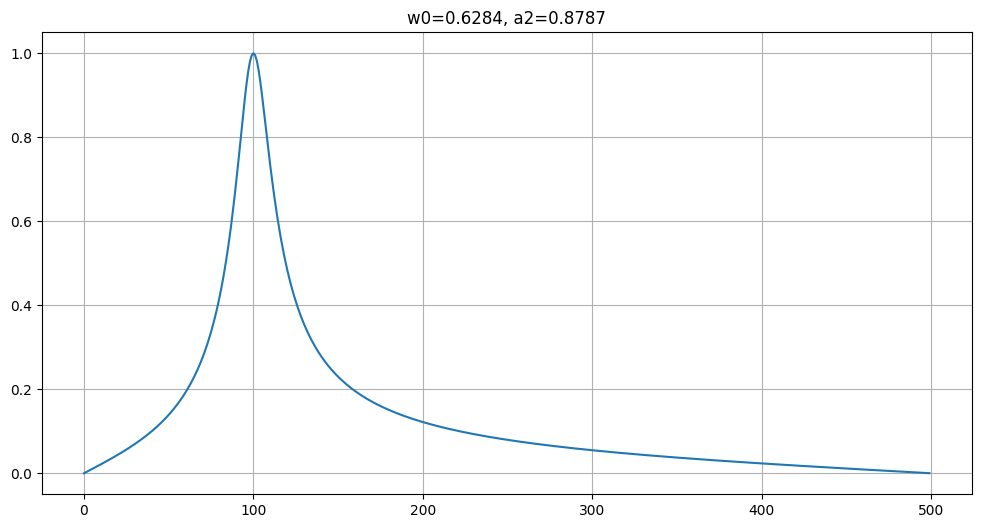
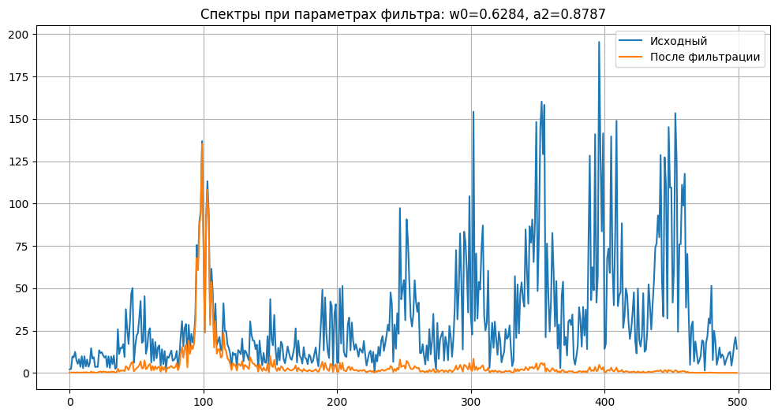

# Поиск оптимальных коэффициентов полосового фильтра

## Постановка задачи
Задан полосовой фильтр 2-го порядка с передаточной функцией

$$\begin{equation}
    {H(z) = \frac{\frac{1-a_2}{2} - \frac{1-a_2}{2} z^{-2}}{1 - (a_2+1)\cos(\omega_0)z^{-1} + a_2 z^{-2}}}.
\end{equation}$$

Необходимо определить значения коэффициентов $\omega_0, a_2$, при которых наилучшим образом выполняется фильтрация зашумленного кода Морзе.

## Предлагаемое решение

Расчеты приведены в блокноте [notebook.ipynb](notebook.ipynb)

### В исходном зашумленном сигнале выделена трендовая составляющая
Применен кратномасштабный анализ с использованием вейвлетов Coiflets (Coif 17). Разложение до 2-го уровня. Флуктуационная составляющая обнулена.

### Вычислен амплитудный спектр трендовой составляющей

Полученный спектр принят в качестве эталона.

### Определена функция потерь как сумма квадратов отклонений спектра фильтрованного сигнала от спектра эталона
### Выполнена минимизация функции потерь методом градиентного спуска
### Построена частотная характеристика фильтра при найденных оптимальных параметрах

### Фильтр применен к исходному зашумленному сигналу

## Ответ
Сигнал соответствует цифре 7.